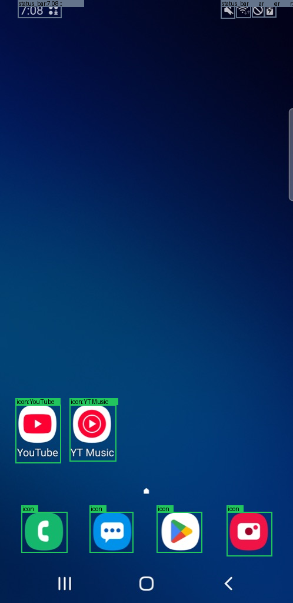
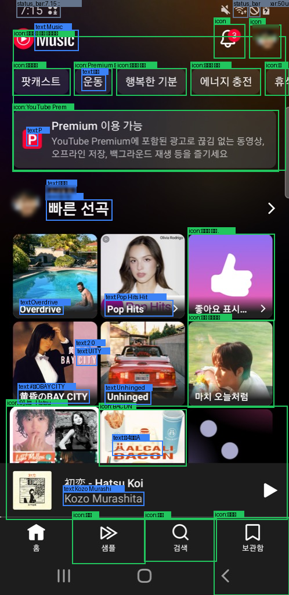
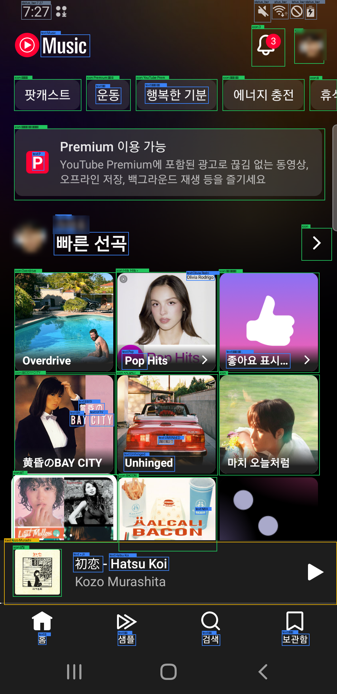
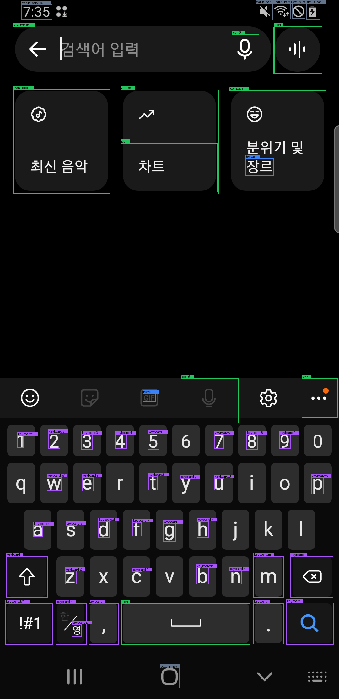
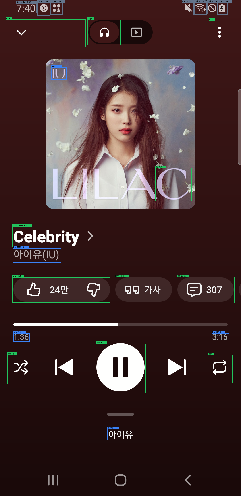

<!--
rough draft — 나중에 블로그용으로 다듬을 초안. 문체·구성 다 손볼 것 전제로
빠르게 정리한 버전입니다. [TODO: ...] 자리는 직접 채워 넣으면 됩니다.
-->

# 안드로이드 화면을 YOLO + OCR로 읽어보기 — PoC 기록

> **발행 전 체크**: 아래 스크린샷·영상에 찍혀 있던 프로필 사진과 본인 이름은
> GitHub 업로드용으로 가려 뒀어요(가리기 전 원본은 `output/_unblurred/`에
> 로컬로만 있어요). 알림 개수 배지(빨간 숫자)는 그대로 남아 있으니, 블로그에
> 올리기 전에 필요하면 마저 가리거나 다른 화면으로 교체하세요.
>
> **영상 재생 관련**: GitHub는 마크다운의 `<video>` 태그를 통째로 지워서 영상이
> 재생되지 않아요(GitHub 마크다운 렌더링 API로 확인). 그래서 각 영상 아래에
> `▶ GitHub에서 보기` 링크를 함께 뒀어요. `<video>` 태그를 지원하는 정적 사이트
> 생성기에서는 바로 재생되고, 최종 발행 플랫폼에 따라 플랫폼 전용 임베드로
> 바꿔야 할 수도 있어요.

## 왜 해봤나

[TODO: jev랑 통합 고려 중이라는 동기, 지금 explore-mobile이 좌표 기반
탭에만 의존하고 있어서 "화면을 보고 이해하는" 레이어가 없었다는 문제의식
— 직접 쓰는 게 좋을 것 같아요]

지금 있는 `explore-mobile` CLI는 스크린샷을 찍고 좌표를 탭하는 것까지는
되는데, "이 화면에 뭐가 있는지"를 구조적으로 아는 기능은 없었다. 나중에
JEV 같은 상위 판단 로직이 "텍스트가 Save인 버튼을 눌러줘" 같은 의도를
받으면, 그 의도를 실제 좌표로 바꿔주는 계층이 필요하다 — 그 계층이
가능한지부터 작은 PoC로 검증해봤다.

## 뭘로 만들었나

- **탐지**: YOLO 기반 UI 아이콘 탐지기 — [OmniParser](https://huggingface.co/microsoft/OmniParser-v2.0)(Microsoft 공개)의
  `icon_detect` 사전학습 가중치. 클래스가 "icon" 하나뿐인 이진 탐지기라,
  "이게 버튼인지 라벨인지"까지는 모르고 그냥 "눌릴 수 있어 보이는 상자"만
  찾아준다.
- **OCR**: [EasyOCR](https://github.com/JaidedAI/EasyOCR) (한국어+영어).
- **캡처**: 새로 안 만들고 기존 `explore-mobile screenshot` 명령을 그대로
  서브프로세스로 호출. 이 CLI는 런타임 의존성 0개가 설계 원칙이라(`sips`로
  이미지 축소), YOLO·OCR 같은 무거운 ML 스택은 절대 그 안에 넣지 않고
  `poc/ui-vision/`이라는 별도 Python 디렉토리로 뺐다.
- **좌표계**: 탐지 결과는 축소된 이미지 좌표 그대로 저장하고, 기기 실좌표로
  바꾸는 계산은 실제 탭 직전에만 한다(기존 `toDeviceCoordinate` 로직을
  그대로 미러링). bbox 하나만 달랑 넘기지 않고, 그 캡처의 `width, height,
  deviceWidth, deviceHeight, scale, capturedAt`을 항상 같이 묶어서 반환한다.

## 데이터 하나가 이렇게 생겼다

```json
{
  "type": "icon",
  "text": "YouTube",
  "bbox": { "x": 26, "y": 687, "width": 77, "height": 99 },
  "confidence": 0.79,
  "enabled": true,
  "clickable": true
}
```

아이콘 상자와, 그 아이콘 바로 아래/위에 겹치는 OCR 텍스트를 자동으로
합쳐서 하나의 요소로 만든다 — 나중에 "Save라는 텍스트를 가진 버튼"처럼
이름으로 찾을 수 있게 하려는 의도.

## 1차 검증 — 홈 화면

연결된 갤럭시 S9(SM-G960N)에서 그냥 홈 화면을 캡처해서 돌려봤다.



- 탐지된 요소: **11개**
- YouTube / YT Music 아이콘이 아래 글자 라벨이랑 정확히 합쳐짐
- 전화·메시지·플레이스토어·카메라 독(dock) 아이콘 4개도 정확히 박스 처리됨
- 상태 바(시계·와이파이 등)는 화면 맨 위 4% 안에 있으면 `status_bar`로
  자동 분류되게 룰을 짜뒀는데, 실제로 그렇게 나옴
- 화면 맨 아래 3버튼 시스템 내비게이션(뒤로/홈/최근앱)은 YOLO가 상자
  자체를 못 찾아서 아예 탐지 목록에 없었다 — 이건 나중에 자꾸 반복되는
  문제라 아래에 따로 적었다

## 2차 검증 — 실제 앱(YT Music) 화면

홈 화면보다 훨씬 복잡한 화면(썸네일·카드·텍스트가 섞인)에서도 되는지
보려고 YT Music을 실행해서 홈 피드를 캡처했다.



- 탐지된 요소: **32개**
- 잘 된 것: 태그 칩, 프로필 사진, 알림 종, Premium 카드, 앨범 썸네일,
  앱 하단 탭(홈/샘플/검색/보관함)까지 대부분 박스·라벨이 제자리에 붙음
- OCR이 흔들린 것 — 이게 다음 개선으로 이어짐:

| 실제 글자 | OCR 결과 |
|---|---|
| 팟캐스트 | 곳개스트 |
| 샘플 | 셈들 |
| 黄昏のBAY CITY | "2 0" / "UITY" / "#습OBAY CITY"로 쪼개짐 |

원인을 의심해보니, `explore-mobile screenshot`이 기본으로 이미지를
**2.17배 축소 + JPEG 재인코딩**해서 넘기고 있었다(원래 이 축소는 다른
목적 — 캡처 파일 용량을 줄이려고 만든 거지, 비전 파이프라인을 염두에 둔
게 아니었다). 작은 한글 글자가 축소+압축을 거치면서 뭉개진 게 OCR
오독의 주범으로 보였다.

## 개선: 캡처 해상도를 원본으로

비전 파이프라인용 캡처만 `--full`(축소·JPEG 없이 원본 그대로, PNG)로
바꿔서 같은 화면을 다시 캡처하고 돌려봤다.



### before / after 수치 비교

| 항목 | 축소본(기본) | 원본(`--full`) |
|---|---:|---:|
| 이미지 해상도 | 498×1024 (scale 2.17, jpeg) | 1080×2220 (scale 1, png) |
| 탐지된 요소 수 | 32개 | **45개** |
| "팟캐스트" 인식 | 오독("곳개스트") | **정확히 읽음** |
| "黄昏のBAY CITY" 인식 | 조각조각 깨짐 | **대부분 정확히 읽음** |
| "Olivia Rodrigo" | 인식 안 됨 | **새로 인식됨** |
| 자동차 번호판 "UNHINGED" | — | 곁다리로 읽어낼 만큼 디테일 살아남 |
| 처리 시간(탐지만, 모델 로드 제외 총합 기준) | 4.40초 | 5.50초 (+1.1초) |

해상도를 올리니 글자 인식은 확실히 좋아졌고, 처리 시간은 1초 정도만
더 들었다 — PoC 스케일에서는 받아들일 만한 트레이드오프였다.

### 근데 공짜는 아니었다 — 새 오탐 발견

원본 해상도로 돌렸더니 화면 하단의 "지금 재생 중" 미니 플레이어 바가
`toast`(알림 배너)로 잘못 분류됐다. 위 이미지에서 노란 테두리로 표시된
부분이 그것 — "넓고 납작한 상자가 화면 하단 근처에 있으면 토스트"라고
짠 휴리스틱이, 모양이 비슷한 미니 플레이어에도 걸려버린 것.

```json
{
  "type": "toast",
  "text": "Kozo Murashita",
  "bbox": { "x": 13, "y": 1733, "width": 1066, "height": 201 },
  "confidence": 0.88
}
```

이 토스트 판별 규칙은 애초에 "실제 토스트가 뜬 화면"으로 검증해본 적이
없는 채로 짠 거였는데(그때도 이 문서에 한계로 적어뒀었다), 이번에
그 한계가 실제 오탐으로 나타난 셈이다. 다음엔 재생 아이콘(▶) 유무 같은
신호를 더해서 미니 플레이어부터 먼저 걸러내야 할 것 같다.

## 속도는 어느 정도인가

단계별로 쪼개서 재보니:

| 단계 | 시간 |
|---|---:|
| 기기 화면 캡처 | 약 0.4초 |
| 파이썬·라이브러리 import | 1.12초 |
| YOLO 모델 로드 | 0.07초 |
| EasyOCR 모델 로드 | 1.31초 |
| YOLO 추론 | 0.21초 |
| OCR 추론(축소본 기준) | 0.72초 |

실제 "찾는 일"(추론)은 1초가 안 걸리고, 시간 대부분은 **매번 새로
파이썬을 켜고 모델을 메모리에 올리는 비용**(≈2.5초)이었다. 지금은
`main.py`를 실행할 때마다 이걸 처음부터 다시 한다 — 한 번 쓰고 끝나는
PoC라 문제는 없지만, JEV처럼 화면을 연속으로 계속 분석해야 하는
시나리오라면 모델을 한 번만 로드해두는 상주 프로세스 형태로 바꿔야
화면당 1초 아래로 줄어들 것 같다.

## 남은 한계 (정직하게)

- `enabled`(버튼 활성/비활성) 필드는 항상 `true` — 비전만으로는
  신뢰성 있게 못 가려서 추측하지 않고 고정값으로 뒀다.
- 키보드·권한 팝업 분류 로직은 짜뒀지만, 아직 실제 키보드/팝업이 뜬
  화면으로는 검증 못 했다.
- 시스템 하단 내비게이션(뒤로/홈/최근앱 3버튼)은 두 화면 모두에서
  YOLO가 상자 자체를 못 찾았다 — 탐지 신뢰도 문턱을 낮추거나, 아예
  ML에 기대지 말고 고정 위치로 항상 만들어 넣는 쪽이 나을 수도.
- 토스트 판별 규칙은 이번에 오탐이 확인됐으니 다듬어야 함(위 참고).
- 클릭 후 실제로 화면이 바뀌었는지 확인하는 루프는 이 PoC 범위 밖 —
  "화면을 보고 구조화하는" 부분만 검증했다.

## 3차 검증 — YT Music 자율탐색 (검색 / 검색결과 / 재생화면)

화면 하나로는 부족해서, YT Music을 직접 조작해가며(검색 탭 → "IU" 검색
→ 결과 목록에서 곡 탭 → 재생화면) 5개 화면을 돌아가며 규칙을 검증했다.
새 코드는 하나도 안 만들고, 이미 있는 `tap`/`text`/`key enter` 명령만
조합해서 탐색했다.

### 발견 1 — 키보드: YOLO는 못 찾고 OCR이 답이었다

검색 탭을 누르면 검색창에 자동으로 커서가 가면서 키보드가 뜬다. 처음
짠 규칙("작은 icon이 격자로 몰려 있으면 키보드")으로 돌려보니 키보드로
분류된 요소가 **0개**였다 — YOLO가 키보드 키 글자를 아이콘으로 단
하나도 못 찾았다. 근데 EasyOCR 결과를 따로 까보니 "q","w","1" 같은
낱글자를 이미 1~2글자 `text`로 정확히 읽고 있었다 — 그냥 안 쓰고
있었을 뿐. 판별 신호를 "작은 icon 격자"에서 "짧은(1~2자) text가
하단에 격자로 몰려 있음"으로 바꿨다.



| | 수정 전 | 수정 후 |
|---|---:|---:|
| keyboard로 분류된 요소 | 0개 | **33개** |

q/e/r/i/o/j/k/l 등 일부는 OCR이 놓쳤지만(사진 참고), 전체 격자를
"키보드가 열려 있다"고 판단하기엔 충분한 개수였다.

### 발견 2 — 토스트 오탐, 재현 확인

"같은 줄에 다른 요소가 있으면 토스트가 아니다"라는 조건을 추가한 뒤,
처음 오탐이 났던 YT Music 홈 화면에 다시 돌려봤다.

| | 수정 전 | 수정 후 |
|---|---:|---:|
| toast로 잘못 분류된 요소 | 1개(미니 플레이어) | **0개** |
| icon으로 올바르게 남은 요소 | 18개 | 19개 |

검색결과 화면에서도(하단에 같은 미니 플레이어가 떠 있는 상태) 토스트
오탐이 재현되지 않았다.

### 발견 3 — 라벨 오병합: 작은 버튼이 엉뚱한 글자를 삼킴

재생 화면(Now Playing)까지 들어가서 돌려보니, 화면 상단 "접기" 버튼
(⌄)이 91px 아래에 있는 앨범아트 속 "IU" 워터마크 글자를 자기 라벨로
잘못 삼키고 있었다.

```json
{"type": "icon", "text": "IU", "bbox": {"x": 26, "y": 86, "width": 358, "height": 125}}
```

원인은 라벨 병합 규칙의 세로 간격 허용치가 "아이콘 높이 × 1.5배"였다는
것 — 큰 아이콘엔 적당해도 이 접기 버튼(125px)엔 187px까지 허용돼서
너무 넉넉했다. 절대 픽셀 상한(40px)을 추가로 걸었다.



수정하고 5개 화면 전부에 다시 돌려 회귀를 확인했는데, 여기서 정직한
발견이 하나 더 나왔다 — 검색결과 화면의 "Love wins all" 곡 제목이
**사실 이 수정 전부터 엉뚱한 셔플 버튼에 잘못 붙어있었다**는 게
드러났다(그땐 못 알아챘던 버그). 수정 후엔 그 잘못된 라벨은
사라졌지만, 진짜 짝(자기 앨범 썸네일)에 다시 붙지는 못하고 독립
텍스트로 남았다 — YOLO가 여러 곡 줄을 하나의 큰 상자로 뭉뚱그려 찾을
때, 그 안에 텍스트가 여러 개면 어느 게 진짜 짝인지 가리는 로직이 아직
약하다. 이건 문턱값 튜닝으로 되는 문제가 아니라서, 이번엔 손 안 대고
한계로 남겨뒀다.

## 4차 — 탐색 흐름을 영상으로도 남기기

지금까지는 액션 전후를 정적 스크린샷으로만 남겼는데, 그러면 "에이전트가
실제로 뭘 했는지" 사람이 한눈에 보기가 어렵다. 그래서 액션마다 짧은
화면 녹화(`adb shell screenrecord`)도 같이 남기기로 했다 — **탐지
파이프라인 입력용이 아니라, 순전히 사람이 나중에 재생해서 볼 관찰용
기록**이다. YOLO/OCR은 지금처럼 압축 없는 원본 PNG 정지 이미지만 쓴다.

### 미검증 포인트 확인 — 그리고 실제로 터진 버그

먼저 원시 기능이 되는지부터 손으로 테스트했다: 백그라운드로
`screenrecord`를 띄워놓고 그 사이에 `tap`/`key` 명령을 따로 보내도
같이 잘 동작했다. 녹화 중지는 처음엔 SIGINT(Ctrl-C)로 중간에 끊는
방식으로 짰는데 — **이게 4번 중 3번 파일을 깨뜨렸다.**

```
[mov,mp4,m4a,3gp,3g2,mj2] moov atom not found
Invalid data found when processing input
```

`moov atom`은 mp4 파일의 "마무리 트레일러"인데, SIGINT로 일찍 끊으면
이게 안 써지는 경우가 잦았다(로컬 adb 클라이언트가 신호를 원격
`screenrecord`까지 안정적으로 전달 못 하는 걸로 보인다 — 정확한 원인은
adb 프로토콜 안쪽이라 더 깊이는 안 팠다). ffprobe로 정상 파일과
깨진 파일을 나란히 비교해서 확인했다:

| | 정상 파일 | 깨진 파일 |
|---|---|---|
| ffprobe 결과 | 스트림 정보 정상(h264, 1080×2220) | `moov atom not found` |

고친 방법: SIGINT로 일찍 끊지 않고, `--time-limit`을 짧게(6초) 잡아서
**자연 종료**될 때까지 그냥 기다리는 걸로 바꿨다. "정확히 이 순간에
멈춰라" 같은 정밀 제어는 포기했지만, 그 대신 여러 번 다시 해도 매번
멀쩡한 파일이 나왔다(4개 스텝 전부 ffprobe로 재검증 완료).

### 재사용 가능한 형태로 정리

`explore_step.run_step(device, 스텝이름, 액션함수)` 하나로 "녹화 시작
→ 액션 실행 → 자연 종료까지 대기 → 원본 화질 정지 캡처 → 기존 탐지
파이프라인"이 전부 이어진다. 산출물은 스텝 이름 하나로 전부 묶인다:

```
output/step-search-page.mp4              ← 사람이 볼 녹화
output/step-search-page.png               ← 탐지 입력(원본 화질)
output/step-search-page.elements.json     ← 탐지 데이터 리스트
output/step-search-page.annotated.png     ← 합성 이미지
```

이 방식으로 홈→검색→검색결과→재생, 4개 전환을 다시 찍었다:

| 스텝 | 액션 | 영상 길이 | 탐지 요소 |
|---|---|---:|---:|
| `step-home-tab` | 홈 탭 탭 | 5.7초 | 43개 |
| `step-search-page` | 검색 탭 탭 | 6.3초 | 57개 |
| `step-search-results` | "IU" 입력 + 엔터 | 6.0초 | 38개 |
| `step-playback` | 첫 검색결과 탭 | 6.0초 | 26개 |

`step-playback.mp4`의 마지막 프레임을 뽑아 확인해보니 탭한 곡("Love
wins all")이 정확히 재생 중인 걸 볼 수 있었다 — 탭→재생 연결이
제대로 됐다는 것도 겸사겸사 확인된 셈.

### 플로우 전체를 파일 하나로

스텝별 클립이 "그 스텝만 다시 보기"엔 좋은데, "이 플로우 전체를 처음부터
끝까지 하나로 보고 싶다"는 요청을 받았다. `screenrecord`는 파일 하나당
180초(3분) 제한이 있어서 애초에 "쭉 이어서 한 번에" 녹화하는 건 긴
플로우에선 안 통한다 — 대신 짧게 끊어 찍은(그래서 안정적인) 클립들을
**끝에 ffmpeg로 이어붙이는** 방식을 택했다. 재인코딩 없이(`-c copy`)
합치니 4개 클립·24초 분량이 그냥 순식간에 끝났다.

```bash
ffmpeg -f concat -safe 0 -i filelist.txt -c copy flow-search-and-play.mp4
```

합쳐진 파일을 프레임 단위로 다시 확인해보니, 첫 프레임은 시작 지점인
검색결과 화면, 마지막 프레임은 재생 화면(0:02 재생 중)으로 정확히
이어져 있었다. 스텝 사이 모델 추론 대기 시간 같은 지루한 구간 없이,
전환만 24초에 깔끔하게 담겼다.

`explore_step.py`에 `run_flow(device, 플로우이름, [Step(...), ...])`로
정리해서, 스텝 목록만 넘기면 각 스텝 실행 + 마지막 합치기까지 한 번에
되게 했다.

### 영상 안에 탐지 결과·액션 대상까지 같이 보여주기

여기서 한 걸음 더 — "영상만 보고도 각 스텝에서 뭘 인식했는지, 다음에
뭘 누를 건지까지 알 수 있어야 한다"는 요청을 받았다. 그래서 원본 녹화
사이사이에 두 종류의 정지 프레임을 끼워 넣었다: (1) 그 스텝의 탐지
합성 이미지(2.5초), (2) 다음 액션이 향할 요소를 빨간 박스+십자선으로
강조한 이미지(2초, "이걸 누를 거다"를 미리 보여줌).

**여기서도 버그가 하나 나왔다.** `-f concat` 데뮤서로 처음 합쳤더니,
개별 클립은 전부 멀쩡한데(각각 ffprobe 확인 완료) 합친 결과에는 이미지
변환 클립들이 통째로 빠지고 원본 녹화만 남아 있었다 — 화면 녹화(가변
프레임레이트)와 이미지 변환 클립(고정 30fps)이 섞이면 데뮤서가 구간을
잘못 처리하는 것으로 보인다. **1초 간격으로 프레임을 뽑아서 색 신호로
검증**해보고서야 발견했다(맨눈으로 두 지점만 봤을 땐 "타이밍이 안
맞나?" 정도로 착각할 뻔했다). concat **필터**(`-filter_complex
concat=...`, 프레임 단위로 디코딩해서 잇는 방식)로 바꾸니 11개 구간이
전부 순서대로 들어갔다 — 이번에도 같은 1초 간격 색 신호 검증으로
직접 확인했다.

`explore_step.run_flow_narrated(device, 플로우이름, [Step(..., action_point=(x,y)), ...])`로
정리했다 — 각 스텝에 `action_point`(그 액션이 실제로 향한 좌표)만
같이 넘기면, 직전 스텝의 결과 화면 위에 그 지점을 자동으로 강조해서
끼워 넣는다.

<!-- 마크다운 뷰어가 <video> 태그를 지원 안 하면 아래 링크로 대체됨 -->
<video src="output/flow-search-and-play-full.mp4" controls width="360">
  <a href="output/flow-search-and-play-full.mp4">flow-search-and-play-full.mp4</a>
</video>

▶ [GitHub에서 보기](output/flow-search-and-play-full.mp4)

*(홈→검색→검색결과→재생, 4개 전환 + 탐지 합성 + 다음 액션 강조까지 담은 40초 영상)*

## 5차 — 더 복잡한 플로우, 그리고 두 번의 진짜 실수

### Android에서 안 되는 제스처들

재생목록 스크롤 → 큐에서 곡 선택 → 메뉴 탭, 좀 더 복잡한 플로우를
시도하면서 더블탭·롱프레스·핀치 같은 다른 액션 타입도 넣어보려 했다.
결과는 둘 다 실패 — 근데 버그가 아니라 **이 CLI가 의도적으로 막아둔
것**이었다:

- **더블탭**: `adb shell input`은 호출마다 새 JVM을 띄워 약 400ms가
  걸리는데, 더블탭 인식 창(250~300ms)보다 길어서 구조적으로 불가능.
  CLI가 바로 이유를 설명하는 에러를 줬다.
- **핀치(멀티터치)**: Android SELinux가 멀티터치 입력 이벤트 직접
  쓰기를 막아서 불가능.
- **롱프레스**: 이 CLI에 아예 명령이 없다.

그래서 tap과 scroll로 다양성을 채웠고, "⋮" 메뉴 탭 하나는 실제로
아무 효과가 없는 걸 그대로 영상에 남겼다 — 액션이 항상 성공하는 건
아니라는 걸 보여주는 정직한 사례였다.

### 실수 1 — 와이파이 아이콘이 강조됨

이 영상을 다시 보니, 사용자가 "⋮ 자리에 와이파이 아이콘이 강조돼
있다"고 지적했다. 확인해보니 진짜였다. 원인: 스텝 사이에 **기록 안 된
탭**(플레이어를 펼치는 탭)을 몰래 끼워넣었는데, 강조 이미지를 만들
때는 그 이전 스텝(아직 안 펼쳐진 화면)을 기준으로 좌표를 찾았다. 그
화면엔 그 좌표에 아무 요소가 없어서, "가장 가까운 요소"로 대체하다가
와이파이 아이콘을 집었다.

**교훈**: 강조 로직 자체는 문제없다 — "액션 사이에 화면을 바꾸는
동작은 전부 이름 붙은 스텝이어야 한다"는 전제를 내가 깬 게 원인이었다.
실제 화면을 다시 탐지해서 진짜 좌표(982,145)를 찾고 다시 탭했더니,
이번엔 진짜로 메뉴가 열렸다(처음 의도했던 바텀시트 테스트가 드디어
성공).

<video src="output/flow2-explore-queue.mp4" controls width="360">
  <a href="output/flow2-explore-queue.mp4">flow2-explore-queue.mp4</a>
</video>

▶ [GitHub에서 보기](output/flow2-explore-queue.mp4)

*(강조 좌표를 고친 뒤의 재생목록 큐 탐색 영상 — "⋮"에 정확히 강조가
들어가고, 실제로 메뉴가 열리는 것까지 담김)*

### 실수 2 — Someday를 탭했는데 갑자기 다른 곡 화면

고친 영상을 다시 보니 이번엔 "Someday를 탭했는데 갑자기 '자꾸만
웃게 돼' 화면으로 넘어간다"는 지적을 받았다. 타임스탬프를 찍어보니:

| 스텝 | 캡처 시각 |
|---|---|
| Someday 탭 | 15:17:33 |
| ⋮ 탭(잘못된 좌표) | 15:19:12 |
| ⋮ 재탐지(수정 작업 중) | **15:25:14** |

**Someday를 탭한 시점과 버그를 고치려고 다시 캡처한 시점 사이에 실제로
6분이 지나 있었다** — 와이파이 버그를 조사하고 기기 연결이 끊겨서
케이블을 재연결하느라 걸린 시간이었다. Someday(3:37)는 이미 재생
중이었으니 그 6분 안에 곡이 끝나고 자동재생으로 다음 곡으로 넘어간
거다. 개별 스텝은 각각 정확했지만, 영상은 그 사이 6분을 통째로
잘라내니까 "탭했더니 뜬금없이 다른 화면"처럼 보였다.

**교훈**: 하나로 이어붙이는 영상은 스텝 사이 실제 시간 간격이 크면
안 된다 — 디버깅 같은 게 중간에 끼면 그 사이 상태가 자연스럽게
바뀔 수 있고, 영상은 그 "왜"를 안 보여주니 이상해 보인다.

### 다시, 깨끗하게 — 트레비스 스캇 검색부터 저장 검증까지

두 실수를 반영해서 처음부터 다시 찍었다: "트레비스 스캇" 검색 →
SICKO MODE 재생 → "⋮" 메뉴 → "보관함에 저장" → 플레이어 접고 보관함
탭에서 **실제로 저장됐는지 확인**까지, 끊김 없이 6스텝을 이어서
진행했다. 이번엔:

- 스텝 사이 시간 간격을 전부 타임스탬프로 확인 — 23~29초로 정상 범위
- 강조 좌표는 매번 그 스텝의 실제 탐지 JSON에서 좌표를 읽어옴(짐작 금지)
- 마지막 스텝에서 보관함 > "노래" 필터를 열어보니 SICKO MODE가
  "최근에 저장됨" 맨 위에 실제로 들어가 있었다 — 저장 액션이 진짜로
  성공했다는 걸 직접 확인한 셈

<video src="output/flow3-travis-scott-save.mp4" controls width="360">
  <a href="output/flow3-travis-scott-save.mp4">flow3-travis-scott-save.mp4</a>
</video>

▶ [GitHub에서 보기](output/flow3-travis-scott-save.mp4)

*(검색→재생→메뉴→저장→검증까지, 끊김 없이 이어진 65초 전체 플로우)*

### 검증 방법에 대한 한 가지 교훈 더

최종 영상을 1초 간격으로 프레임 뽑아서 색 신호로 검증했는데, 몇 군데서
"강조 색이 안 잡힌다"는 결과가 나왔다. 지난번(클립 통째로 빠짐)
경험이 있어서 진짜 버그인 줄 알고 그 구간을 `-ss`로 직접 다시
추출해서 봤더니 — **내용은 멀쩡히 다 들어있었다.** 1초 간격 자동
샘플링이 정확한 경계 프레임을 못 맞춰서 생긴 오탐이었다(ffmpeg의
`-ss` 탐색 자체가 완벽히 정밀하진 않다). 자동 검증도 결국 눈으로
직접 확인하는 것만큼 믿을 순 없다는 걸 다시 확인했다.

## 6차 — jev에게 다음 액션 판단을 맡기기

jev(TypeSafe AI)가 활성화돼서, 처음 동기로 적어뒀던 "탐지 결과를 가지고
다음 액션을 뭘 할지는 상위 판단 로직에 맡긴다"를 실제로 붙여볼 차례가
됐다.

### 무엇을 물어보나

jev의 **Choice**(여러 선택지 중 하나를 고르는 질문 타입)를 써서, 화면
하나마다 최대 세 가지를 한 번에 묻는다:

- `action_type` — tap / swipe / scroll / text / key 중 뭘 할지
- `target_element` — clickable한 요소 중 어느 걸 대상으로 할지
- `text_value` — (텍스트를 입력해야 할 때만) `{"빈지노": "검색할 아티스트 이름"}`처럼
  미리 준 후보 중 뭐가 맞는지. 후보 키가 곧 실제로 입력될 문자열이라
  별도 조회表 없이 jev 응답을 그대로 쓴다.

세 질문 모두 **"unsure"(판단불가)** 를 기본 선택지로 갖는다 — 화면
정보만으로 확신 있게 못 고르겠으면 jev가 그걸 고르고, 그러면 아무
것도 실행하지 않고 멈춘다. 그 시점 화면을 사람(나 대신 Claude)이 보고
직접 다음 행동을 정해서 넘겨주면, 그걸 그대로 실행하고 자동 진행을
다시 이어간다 — "jev가 판단 못 하면 사람이 개입한다"는 폴백 구조다.

### 1차 시도 — 빈지노 검색부터 보관함 저장까지

실제 목표를 줘봤다: "빈지노의 Always Awake 노래를 찾아서 재생하고,
보관함에 저장해줘." 새 코드는 없고, 이미 있는 explore-mobile CLI 명령
(tap/text/key)을 `act.py`가 그대로 호출하게만 이었다.

결과 — 성공은 했지만 순탄친 않았다:

<video src="output/flow-binzino-always-awake.mp4" controls width="360">
  <a href="output/flow-binzino-always-awake.mp4">flow-binzino-always-awake.mp4</a>
</video>

▶ [GitHub에서 보기](output/flow-binzino-always-awake.mp4)

*(YT Music 홈 → 검색 → 재생 → 보관함 저장까지, 판단불가 개입 구간까지 담은 62초 영상)*

발견이 세 개 나왔다:

1. **확신도가 높아도 틀릴 수 있다.** 검색 자동완성에서 jev가 confidence
   0.97로 "(Bonus Track) Always Awake" 항목을 골랐는데, 실제로는 탐지
   상자가 부정확하게 잡혀 있어서 바로 위 아티스트 행이 눌렸다 —
   "Love wins all" 라벨 오병합 사례(5차)와 같은 구조적 한계다.
2. **판단불가 문턱을 애매하게 못 넘는 오답이 있다.** confidence 0.67짜리
   선택(아이콘·라벨이 잘못 병합된 요소)이 그대로 실행되면서 엉뚱한
   화면(보관함 탭)으로 샜다. `needs_intervention`은 "jev 스스로
   불확실하다고 답했는가"만 보기 때문에, 중간 정도 확신도의 오답까지는
   못 걸러준다.
3. **메뉴 항목은 애초에 후보에 안 들어갔다.** "⋮" 메뉴를 열어서
   "보관함에 저장"을 누르는 단계에서 jev가 계속 판단불가를 냈다 —
   원인을 파보니 `type: "text"` 요소는 `clickable: false`로 고정돼
   있어서(OCR 글자에는 "눌릴 것 같다"는 신호가 없다는 이유였다), 메뉴
   항목처럼 아이콘 없이 순수 텍스트로만 인식되는 요소는 후보 목록에
   아예 오르지 못했다. 저장·검색·홈 탭 라벨까지 전부 이 문제였다.

세 번째 발견은 코드 결함이라기보다 애초에 근거 없는 가정이었다 —
`detect.py`에 아무 설명도 없이 `clickable=False`로 박혀 있었다. 그래서
`CLICKABLE_TYPES`에 `"text"`를 추가했다(`status_bar`·`toast`는 실제로
안 눌리는 게 확실해서 그대로 뺐다). 트레이드오프는 있다 — 조회수·
아티스트명 같은 정보성 텍스트도 이제 후보에 올라가서, jev가 그런
텍스트를 버튼으로 착각할 위험이 새로 생겼다(아직 실측 안 됨).

### 2차 시도 — 수정 후 같은 플로우, 수치로 비교

같은 목표로 처음부터 다시 돌렸다(공정한 비교를 위해 홈 화면부터
시작 — 직전 실행이 보관함에 저장해둔 곡은 지우고 시작했다).

<video src="output/flow2-binzino-always-awake-narrated.mp4" controls width="360">
  <a href="output/flow2-binzino-always-awake-narrated.mp4">flow2-binzino-always-awake-narrated.mp4</a>
</video>

▶ [GitHub에서 보기](output/flow2-binzino-always-awake-narrated.mp4)

*(수정 후 66초 영상. 이번엔 스텝마다 [액션 대상을 빨간 박스+좌표
십자선으로 강조한 프레임] → [실제 녹화] → [탐지 합성 이미지]를 끼워
넣었다 — `detect.draw_annotated_image()`의 `highlight_point`와
`record.image_to_clip()`/`concat_mixed_clips()`를 그대로 재사용했다.
새 코드는 `autostep.py`에 `narrate=True` 플래그 하나뿐이다.)*

| 지표 | 수정 전 | 수정 후 |
|---|---:|---:|
| jev가 스스로 판단 & 성공 | 2회 | **5회** |
| jev가 스스로 판단했지만 오답 | 2회 | **0회** |
| jev 판단불가(정상 방어) | 3회 | 1회 |
| 사람이 직접 실행한 스텝 | 6회 | **2회** |
| 오답 복구용 낭비 스텝 | 3회 | **0회** |
| 목표까지 총 실행 스텝 | 10회 | **7회** |

가장 깨끗한 비교 지점은 "⋮ 메뉴 → 보관함에 저장" 선택이다 — 수정
전엔 이 화면에서 매번 판단불가가 났는데, 수정 후엔 jev가 confidence
**1.00**으로 스스로 골랐다. 수정이 겨냥한 지점과 정확히 일치하는
결과라 가장 신뢰할 만하다.

다만 정직하게 밝히면: 2차 실행의 "검색 기록 제안 탭 → 결과 페이지
직행" 단계는 1차 실행 때 없던 검색 기록이 남아 있어서 생긴 지름길이라,
clickable 수정 자체의 효과로 온전히 돌리긴 어렵다 — 순수하게
비교 가능한 지점은 저장 메뉴 선택 하나뿐이라고 보는 게 맞다.

### jev 응답은 얼마나 빠른가

같은 화면으로 jev를 3번 불러봤다: 0.78초 / 0.55초 / 0.62초, 평균
**0.65초**. 이걸 기존 파이프라인 속도(위 "속도는 어느 정도인가" 절)
위에 얹으면:

| 단계 | jev 도입 전 | jev 도입 후 |
|---|---:|---:|
| 화면 캡처(`--full`) | 0.73초 | 0.73초 |
| 탐지(YOLO+OCR+분류) | 4.7초 | 4.7초 |
| jev 판단 | — | +0.65초 |
| **스텝당 합계** | **~5.4초** | **~6.1초** |

jev가 더하는 시간은 전체의 약 11%뿐이다. **진짜 병목은 여전히 탐지
단계다** — 같은 프로세스 안에서 `detect()`를 두 번 연달아 불러도
4.66초 → 4.52초로 거의 안 줄었다. YOLO·EasyOCR 객체를 호출할 때마다
새로 만들기 때문인데, 이건 처음부터 "다음" 항목에 적어뒀던
상주 프로세스화 이유(≈2.5초 모델 로딩 비용) 그대로다 — 오히려 이번에
재보니 그 비용이 2.5초가 아니라 4.7초 전체에 가깝다는 게 더 분명해졌다.
jev를 더 빠르게 만드는 것보다 이 상주 프로세스화가 체감 속도에 7배는
더 크게 영향을 준다.

## 7차 — 모델 상주 프로세스, 그리고 진짜 병목 찾기

"다음" 항목에 오래 적혀 있던 상주 프로세스화를 바로 시도해봤다.

### model_server.py — 모델을 한 번만 불러오기

`main.py`/`decide.py`가 매번 새 파이썬 프로세스로 실행되는 지금 구조
에서는, 프로세스 안 캐싱만으로는 소용이 없다 — 프로세스가 끝나면 같이
사라진다. 그래서 표준 라이브러리 `http.server`만으로 작은 HTTP 서버
(`model_server.py`)를 만들었다: 시작할 때 YOLO·EasyOCR을 한 번만 불러와
계속 떠 있고, `/detect` 요청이 오면 그 모델을 재사용한다. `main.py`/
`autostep.py`엔 `--server` 플래그만 추가했다 — 안 쓰면 기존 방식
그대로다.

서버로 재보니 스텝당 4.7초 → **2.8초**로 줄었다. 개선은 됐는데,
"모델 로딩이 없어지면 거의 공짜(1초 아래)일 것"이라던 기대에는
못 미쳤다. 왜 그런지 YOLO/OCR을 나눠서 다시 쟀다: YOLO 추론은 0.2초로
빠른데, **EasyOCR 추론 자체가 이미 모델을 불러온 상태에서도 ≈3초**
걸렸다. 즉 지금까지 "모델 로딩 비용"이라고 뭉뚱그려 불렀던 것의
정체는 사실 대부분 "원본 해상도에서의 OCR 추론 시간"이었다 — "속도는
어느 정도인가" 절의 OCR 0.72초는 **축소된 이미지** 기준이었지 `--full`
원본 해상도 기준이 아니었다.

### 잠깐 잘못된 방향으로 갈 뻔했다

여기서 "그럼 OCR만 축소 이미지로 돌리면 어떨까"를 다음 단계로
제안했는데, 사용자가 바로 잡아줬다 — **이건 "개선: 캡처 해상도를
원본으로" 절에서 이미 실측으로 기각한 방향**이었다("팟캐스트"→
"곳개스트" 같은 오독). 병목을 찾았다고 해서, 이미 근거를 가지고
버린 해법으로 되돌아가는 게 정당화되진 않는다 — 좋은 교정이었다.

### MPS(애플 실리콘 GPU) — 해상도는 그대로 두고 속도만 줄이기

해상도를 안 건드리고 속도만 줄일 방법을 다시 찾았다. `easyocr==1.7.2`
소스를 보니 `gpu=True`를 주면 `torch.backends.mps.is_available()`을
직접 확인해서 자동으로 MPS(애플 실리콘 GPU)를 쓰는 분기가 있었다 —
근데 코드는 `gpu=False`로 고정해뒀다. 이 맥에서 `torch.backends.mps.
is_available()`은 `True`였다.

바꿔서 재보니:

| | CPU(`gpu=False`) | MPS(`gpu=True`) |
|---|---:|---:|
| OCR 추론(원본 해상도, 2번째 호출부터) | ≈3.0초 | **≈0.65초** |
| 첫 호출(워밍업 포함) | — | ≈2.7초 |

**정확도 검증도 했다** — 같은 이미지를 CPU/MPS 양쪽으로 돌려서 인식된
텍스트 37개를 정렬해 비교했더니 글자 하나까지 완전히 동일했다. 해상도를
안 건드렸으니 당연하다면 당연한데, 그래도 "빨라진 대신 뭔가 놓쳤을
수도 있다"는 의심은 직접 비교해서 지웠다.

서버(모델 재로드 제거) + MPS(OCR 가속)를 합쳐서 실기기로 캡처+탐지
전체를 3번 재봤다: 1.94초 / 1.74초 / 1.58초. **원래 ~5.4초 대비 약
3배**다.

### 조건이 하나 있다

`--server` 없이(즉 지금처럼 스텝마다 새 파이썬 프로세스로) `gpu=True`만
켜면 어떻게 될지도 재봤다 — 4.8초, 6.6초로 오히려 원래 CPU 경로(~5.4초)
와 비슷하거나 느렸다. MPS는 첫 호출에 ≈2초짜리 워밍업이 있는데,
매번 새 프로세스면 그 워밍업을 매번 새로 낸다. **MPS 이득은 상주
서버와 짝을 이룰 때만 확실하다** — 워밍업 비용을 한 번만 내고
계속 떠 있는 프로세스에서 나눠 쓸 수 있어야 한다.

## 마무리 생각 — 100%는 안 될 것 같다, 그래도 괜찮은 이유

[TODO: 여기 내 목소리로 더 다듬기]

이 PoC를 해보고 나서 내린 결론: 화면 인식은 **절대 100%가 안 된다**.
그리고 그건 이 PoC가 부족해서가 아니라 원래 그런 종류의 문제다. 오늘
나온 오류를 다시 보면 랜덤한 실수가 아니라 패턴이 있었다:

1. **시스템 UI처럼 "아이콘답게" 안 생긴 요소는 원천적으로 못 본다** —
   하단 내비게이션 바가 그랬다.
2. **반복되는 촘촘한 구조는 다른 신호로 보완해야 한다** — 키보드가
   그랬다(OCR로 우회해서 해결).
3. **화면이 복잡해지면 탐지 상자 자체가 부정확해지고, 그러면 "이
   상자에 어느 텍스트가 진짜 짝인지" 가리는 문제가 생긴다** — "Love
   wins all" 사례. 구조적 한계라 문턱값으로 못 고친다.

그래서 결론은: 탐지 결과를 **"정답"이 아니라 "후보"로 다루는 설계**가
맞다고 본다. 처음에 요구사항으로 적었던 "클릭 후 화면 변화를 반드시
확인하라"가 정확히 이 문제의 답이다 — 탐지가 90%든 95%든, 탭한 다음에
의도한 화면 변화가 실제로 일어났는지 확인하는 루프가 있으면 나머지
오차는 실행 시점에 스스로 걸러진다. 정확도를 더 쥐어짜는 것보다, 그
검증 루프를 먼저 만드는 게 투자 대비 효과가 클 것 같다.

(참고: 오늘 잰 수치는 5개 화면에 대한 정성적 관찰이지, 정식 정확도
벤치마크는 아니다.)

## 8차 — "보관함 함정" — 목표 문장 단어가 화면 라벨과 우연히 겹치는 문제

"김범수의 끝사랑 노래를 찾아서 보관함에 저장해줘"로 실측하다가 재현되는
버그를 발견했다: 목표 문장에 있는 "보관함"이라는 글자가 화면 하단
탭("홈/샘플/검색/보관함") 라벨과 우연히 겹치자, jev가 문맥과 무관하게
그 탭으로 끌려갔다 — 같은 실행 안에서 **두 번** 재현됐다(검색을 시작도
하기 전인 홈 화면에서 한 번, 검색어를 입력한 직후 한 번).

| 스텝 | 화면 상태 | 잘못 고른 것 | confidence |
|---|---|---:|---:|
| 1번째 재현 | 홈 화면(검색 시작 전) | `text` 액션으로 "보관함" 탭에 검색어 입력 | action_type 0.40 / target 0.48 |
| 2번째 재현 | 검색어 입력 직후 | "보관함" 탭으로 tap | action_type **0.96** / target 0.53 |

두 번째 사례가 특히 위험했다 — action_type 확신도가 0.96으로 매우
높았는데(jev 스스로는 "이건 tap이 맞다"고 강하게 확신), 정작 어디를
누를지(target)는 confidence 0.53으로 애매했다. 그런데 당시
`needs_intervention`은 `action_type == "unsure"`인지만 봤기 때문에,
이 애매한 target 선택이 걸러지지 않고 그대로 실행됐다.

처음엔 "화면마다 하위 목표를 다르게 줘볼까"란 생각으로 앱별 단계
이름(탐색/검색입력/결과확인/저장/검증 같은 YT Music 전용 용어)을
하드코딩하려다가, 이건 다른 앱·다른 목표에 못 쓰는 방향이라 반려했다
— 범용이어야 한다는 게 맞는 지적이었다. jev 공식 문서(`docs.typesafe.ai`)의
체이닝 패턴(`cookbooks/hierarchical_classification.md`)과
confidence-routing 패턴(`patterns/confidence-routing.md`)을 조사해서,
앱·목표에 무관한 구조로 다시 짰다.

### 무엇을 바꿨나

1. **구조적 단계 분류를 먼저 묻는다.** action_type/target_element를
   묻기 전에 "이 화면은 목표를 기준으로 어느 단계인가"를 고정 6개
   후보(목표_요소_보임/탐색_필요/입력_필요/중간_확인창/완료_확인/
   판단불가)로 먼저 분류하는 Choice 호출을 하나 추가했다. 그 답으로
   다음 질문의 지시문을 파이썬 쪽 사전에서 골라 쓴다 — 앱 이름도
   목표 문장도 등장하지 않는 일반 문장이라 아무 화면에나 재사용된다.
2. **목표 문장 중복 인용을 없앴다.** 원래는 `state`에도 목표를 넣고
   매 질문 `instructions`에도 `f"목표: {goal!r}. ..."`로 또 넣었다.
   이제 목표 원문은 `state`에만 한 번 실리고, 질문 instructions는
   위 1번의 단계별 일반 문장으로 대체했다 — 목표 문장 속 단어를
   반복해서 강조하지 않으니 그 글자로 끌려갈 이유 자체가 줄어든다.
3. **confidence 임계값 라우팅을 추가했다.** jev 공식 문서가 권하는
   0.6(바닥선)/0.85(고위험 작업 기준) 2단 임계값을
   `Decision.needs_intervention`에 반영했다 — `unsure`가 아니어도
   관련 confidence가 0.85를 못 넘으면 사람에게 넘긴다. 이 파이프라인엔
   "사용자 확인" 단계가 따로 없어서 0.6~0.85 구간도 곧장 사람 개입으로
   합쳐진다.

### 검증 — 저장해둔 화면으로 재현, 그리고 실기기로 재실측

같은 화면 데이터(`auto3-000`/`auto3-003.elements.json`, 버그가
재현됐던 바로 그 캡처)에 새 코드로 다시 물어봤다:

| 스텝 | 수정 전 | 수정 후 |
|---|---|---|
| 1번째 재현 지점 | target: "보관함"(0.48), **그대로 실행됨** | 단계: 입력_필요. target: "검색"(0.88)로 바뀜. action_type 확신도(0.39)가 낮아 **개입 필요로 멈춤** |
| 2번째 재현 지점 | target: "보관함"(0.53), **그대로 실행됨** | 단계: 목표_요소_보임(0.91). target은 여전히 "보관함"(0.49)을 고름 — **하지만 confidence가 낮아 개입 필요로 멈춤** |

정직하게 밝히면: 2번째 지점은 단계 분류를 추가해도 jev가 여전히
"보관함"에 끌렸다 — 1번 변경만으로는 이 사례를 완전히 못 막았다.
그래도 3번 변경(confidence 임계값)이 안전망 역할을 해서, 두 사례
모두 이제는 **사람 확인 없이 조용히 실행되는 일이 없다**. 기존에
확신도가 높았던 결정 3개(저장 버튼/재생목록/확인 버튼, confidence
0.98~1.00)는 그대로 개입 없이 통과해서, 회귀는 없었다.

실기기로도 처음부터 다시 돌렸다(YT Music을 완전히 재시작하고 같은
목표로 재검색) — 원래 버그가 났던 두 지점 모두 이번엔 jev가 스스로
멈추고 개입을 요청했다. 그 지점마다 실제 화면을 보고 직접 다음
행동을 골라줬더니(검색 아이콘 탭 → 검색 기록에서 곡명 탭 → 저장
버튼 탭 → "좋아요 표시한 음악"에 추가), 목표까지 문제없이 도달했다.
전혀 다른 화면(안드로이드 설정 앱, 이 PoC가 한 번도 다뤄본 적 없는
화면)에 임의의 목표("블루투스 설정으로 들어가고 싶어")로도 시험해
봤는데, 코드 수정 없이 단계 분류·일반 지시문이 그대로 동작했다 —
다만 이 화면에서는 후보 3개(설정/연결/Wi-Fi 아이콘)의 확신도가
0.4~0.5로 고르게 갈려서 jev가 매번 개입을 요청했다(이건 아이콘 OCR
텍스트가 여러 글자와 뭉쳐 인식된, 이미 알려진 탐지 단계의 한계이지
이번 수정의 결함은 아니다).

### 남은 것

confidence 임계값이 안전망으로는 확실히 작동하지만, **잘못된 선택
자체를 막는 건 아니다** — "보관함" 함정은 여전히 가끔 발생하고,
사람 개입 빈도가 그만큼 늘어난다. `criteria`에 `not_for`/`examples`
필드(jev 문서가 제공하는, "이건 아님"을 명시하는 공식 메커니즘)를
써서 목표 문장과 글자가 겹치는 후보를 대상에서 명시적으로 배제하는
방향을 다음에 시도해볼 만하다. 또한 단계 분류 질문이 하나 늘어서
jev 호출이 스텝당 1번에서 2번으로 늘었는데(순차 호출이라 지연시간도
늘어난다), 오늘은 이걸 따로 재지 않았다 — 다음에 잴 것.

## 9차 — 완전히 다른 도메인에서 재보기: 네이티브 앱이 아니라 웹 브라우저

8차까지는 전부 YT Music이나 설정 앱처럼 네이티브 안드로이드 앱이었다.
이번엔 더 낯선 도메인으로 범용성을 시험했다: Chrome 브라우저를 열고
naver.com에 들어가서, 스포츠 탭으로 이동해서, 기사를 하나 열어보는
플로우다. 웹페이지는 네이티브 앱과 달리 스크롤에 따라 요소가 완전히
새로 로드되고, 링크/버튼 구분이 앱보다 애매한 경우가 많아서 좋은
스트레스 테스트가 될 거라 생각했다.

플로우: Chrome 새 탭 → 주소창에 "naver.com" 입력 → 자동완성 제안 탭
→ 네이버 홈 → "스포츠" 탭 → 스크롤 → 기사 하나 열기.

### 결과 — 이번엔 글자 함정이 아예 안 나왔다

결정 지점 5개를 다 확인했다:

| 스텝 | jev가 고른 것 | confidence | 처리 |
|---|---|---:|---|
| 주소창에 naver.com 입력 | 정확 | 0.60 / 0.54 | 개입 요청 → 승인 |
| 자동완성 제안 탭 | 정확 | 0.99 / 0.52 | 개입 요청 → 승인 |
| "스포" 빠른 링크 탭 | 정확(글자는 맞게 골랐음) | 0.98 / 0.91 | **자동 실행** |
| "스포츠" 탭(스크롤 후 상단바) | 정확 | 1.00 / 0.74 | 개입 요청 → 승인 |
| 기사 하나 열기 | 정확("아무거나"라 valid) | 0.99 / 0.70 | 개입 요청 → 승인 |

다섯 곳 모두 jev가 의미상 맞는 후보를 골랐다 — 8차의 "보관함" 같은
글자 함정이 이번엔 한 번도 재현되지 않았다. confidence가 대부분
0.85(고위험 작업 기준)를 못 넘어서 5개 중 4개는 개입 요청으로
멈췄고 사람이 확인 후 승인했다. 1개("스포" 빠른 링크 탭, confidence
0.98/0.91)만 자동으로 실행됐는데, 여기서 이번 도메인 확장의 진짜
흥미로운 발견이 나왔다.

### jev는 옳았는데 페이지가 안 움직였다

네이버 홈 맨 위에는 "메일/카페/쇼핑/뉴스/엔터/스포"로 된 빠른 링크
줄이 있다. jev가 정확히 "스포"를 골라 confidence 0.98/0.91로
자동 탭했는데 — 화면이 전혀 안 바뀌었다. 같은 위치를 좌표까지
다시 확인해서 재시도했는데도 마찬가지였다. `decide.py`가 잘못
고른 게 아니라, **이 페이지의 그 빠른 링크 줄 자체가 탭에 반응을
안 하는 것으로 보인다**(지연 로딩된 클릭 핸들러가 안 붙어있는 등
웹페이지 쪽 문제로 추정 — 정확한 원인은 확인 못 했다).

대신 페이지를 스크롤해서 나오는 sticky 상단 탭바("추천/뉴스/엔터/
스포츠")의 "스포츠"는 탭 한 번에 정상적으로 스포츠 섹션으로
이동했다. 같은 글자, 같은 의미의 링크인데 위치(스크롤 전 vs 후)에
따라 실제로 동작하는지 여부가 갈렸다는 뜻이다. jev의 판단 능력과는
무관한, "화면에 보이는 게 전부 실제로 클릭 가능한 건 아니다"라는
웹 자동화 고유의 함정을 하나 새로 확인한 셈이다.

### 영상 산출물

`autostep.py`의 `narrate=True`로 스텝마다 [강조 클립] → [원본 녹화]
→ [탐지 합성] 클립을 만들고, `record.concat_mixed_clips()`로
하나로 이어 붙여서 `output/flow-naver-sports-narrated.mp4`(42초)를
만들었다. 다만 스크롤 구간은 `explore-mobile scroll` 명령을 raw로
호출해서 녹화 파이프라인(`explore_step.run_step`)을 거치지 않았기
때문에 영상엔 빠져 있다 — tap/text 스텝만 녹화가 붙는다.

### 남은 것

- 스크롤도 녹화가 붙게 만들기 — 지금은 tap/text 스텝만
  `explore_step.run_step()`을 거쳐서 녹화된다.
- "화면에 보이는 요소가 실제로 클릭 가능한지"를 스크린샷만으로는
  구분할 방법이 없다 — 8차 "다음"에서 이미 1순위로 적어둔 "탭 →
  재검증(화면 변화 확인) 루프"가 정확히 이 문제도 잡아준다. 오늘
  자동 실행됐던 "스포" 탭처럼 confidence는 높은데 실제로는 아무
  일도 안 일어난 경우를, 실행 직후 화면이 바뀌었는지 확인하는
  루프가 있었다면 즉시 잡아냈을 것이다.

## 다음

~~jev 활성화되면 다음 액션 선택을 맡기기~~ — 완료(6차, `decide.py`).
Choice 질문 3개(action_type/target_element/text_value) + "판단불가"
기본 옵션으로 jev와 사람(Claude) 개입을 나눴고, 빈지노 검색→재생→
보관함 저장까지 실기기로 끝까지 확인했다.

- **탭 → 재검증(변화 확인) 루프 만들기** — 여전히 1순위. 이번에 정확히
  왜 필요한지도 실측으로 나왔다: jev가 confidence 0.67짜리 애매한
  판단을 판단불가 문턱 없이 그대로 실행해버린 사례가 있었다(6차) —
  자동으로 "의도한 화면 변화가 실제로 일어났는가"를 확인하는 루프가
  있었다면 사람이 화면을 눈으로 보기 전에 스크립트가 먼저 잡아냈을
  것이다. 액션 타입별로 확인 범위·성공 조건이 다르다는 점도 반영해야
  함(tap/text 입력/swipe마다 "뭘 봐야 성공인지"가 다름). Android에서
  double tap·pinch·long press는 애초에 못 쓰니 이 셋은 검증 대상에서
  제외
- ~~상주 프로세스화~~ — 완료(7차, `model_server.py`). 모델 재로드 제거
  + MPS(애플 실리콘 GPU) 가속을 합쳐서 캡처+탐지 전체가 ~5.4초 →
  ~1.7초로 줄었다. 단, `--server`와 짝을 이룰 때만 이득이 확실하다
  (MPS 워밍업 비용 때문에 서버 없이 쓰면 상쇄됨)
- "한 상자에 텍스트 여러 개가 겹칠 때 진짜 짝 가리기" — 남겨둔 구조적 한계
- ~~탐색 스텝을 (이름, 액션, 좌표) 자동 로그로 남겨서 조립 실수 막기~~ —
  당장은 스텝 사이 시간 간격을 타임스탬프로 매번 확인하는 것으로 대체.
  자동 로그 도구는 여전히 만들면 좋을 듯
- 시스템 내비바 고정 영역 처리
- **정보성 텍스트를 버튼으로 착각하는 사례 확인** — `text`를 전부
  clickable 후보에 넣은(6차) 트레이드오프로 새로 생긴 위험. 조회수·
  아티스트명 같은 안 눌리는 텍스트를 jev가 잘못 고르는 사례가 실제로
  있는지 아직 확인 못 함
- ~~스텝별 녹화~~ — 완료(`explore_step.run_step()`), moov atom 버그까지 잡음
- ~~영상에 탐지 결과·액션 대상 강조 표시~~ — 완료(6차, `autostep.py`
  `narrate=True`) — 4차에서 만든 `run_flow_narrated()`용 재료
  (`draw_annotated_image`의 `highlight_point`, `image_to_clip`,
  `concat_mixed_clips`)를 jev 자동 루프에도 그대로 재사용했다
- ~~"보관함 함정" — 목표 문장 단어가 화면 라벨과 겹쳐서 jev가 끌려가는
  문제~~ — 완료(8차). 단계 분류 Choice + 목표 중복 인용 제거 +
  confidence 임계값 라우팅으로, 재현됐던 두 지점 모두 이제 조용히
  실행되지 않고 사람 개입으로 멈춘다
- **`criteria`에 `not_for`/`examples` 필드 실험** — 8차에서 confidence
  임계값으로 막긴 했지만, 단계 분류만으로는 "보관함" 함정을 완전히
  못 막은 사례가 남아 있다. jev 문서가 제공하는 명시적 배제 메커니즘을
  `target_element` criteria에 시험해볼 것
- **단계 분류 추가로 늘어난 jev 호출 지연시간 측정** — 8차부터 스텝당
  jev 호출이 1번(병렬 질문 3개)에서 2번(순차)으로 늘었는데 아직
  안 쟀다
- ~~완전히 다른 도메인(웹 브라우저)에서 범용성 재확인~~ — 완료(9차).
  Chrome→naver.com→스포츠→기사 플로우, 5개 결정 지점 전부 jev가
  의미상 맞는 후보를 골랐고 "보관함" 같은 글자 함정도 재현 안 됐다
- **스크롤 액션에도 녹화 붙이기** — 9차에서 tap/text 스텝만
  `explore_step.run_step()`을 거쳐 녹화되고, raw `scroll` 명령은
  녹화 파이프라인 밖이라 플로우 영상에서 스크롤 구간이 빠졌다
- **"클릭 가능해 보이지만 실제론 안 눌리는 요소" 문제** — 9차에서
  jev가 confidence 0.98/0.91로 정확히 고른 "스포" 링크를 탭했는데도
  페이지가 안 바뀐 사례 발견(웹페이지 쪽 문제로 추정, 원인 미확정).
  jev 판단과 무관한 문제라 confidence로는 못 막고, 위 "탭 →
  재검증(화면 변화 확인) 루프"가 있어야 잡힌다 — 그 항목의 우선순위를
  다시 한번 뒷받침하는 사례
